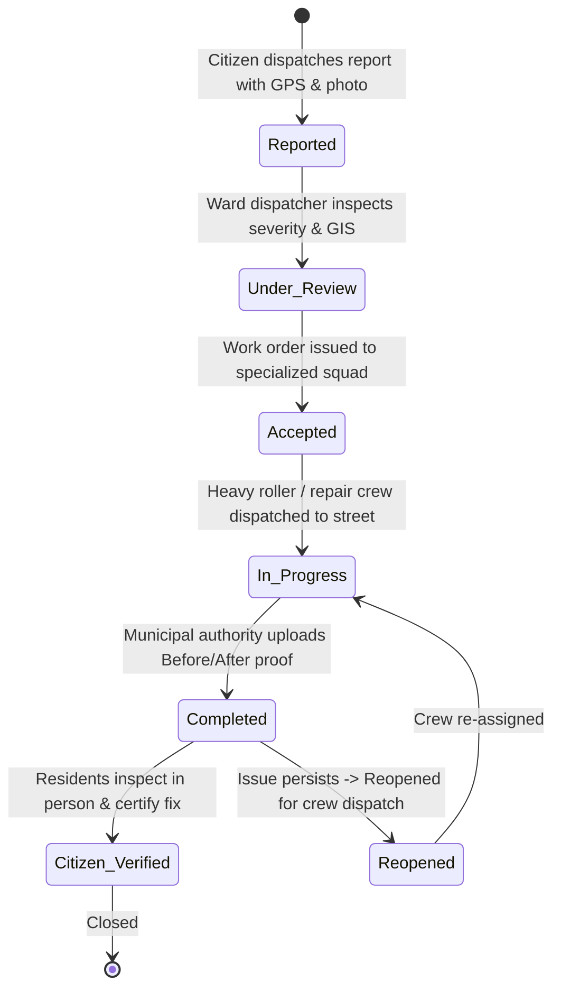

# CivicVoice — Location-Based Civic Issue Dispatch & Resolution Platform

> **A community-driven digital civic platform connecting citizen dispatches directly to municipal public works with transparent, before-and-after photo verification.**

[](https://react.dev/)
[](https://vitejs.dev/)
[](https://tailwindcss.com/)
[](https://developer.mozilla.org/en-US/docs/Web/API/Web_Audio_API)
[]()

---

## 🏛️ Project Overview

Citizens regularly encounter civic problems such as hazardous potholes, damaged road asphalt, overflowing garbage dumpsters, broken streetlamps causing blackout zones, clogged storm drains, and compromised park infrastructure.

**CivicVoice** provides an intuitive, location-based reporting and resolution tracking web platform that eliminates bureaucratic black holes. Instead of filing reports into forgotten municipal inboxes, citizens dispatch geolocated reports with photographic proof, neighbors can co-sign existing issues to prevent duplicates, and city crews must upload verified completion evidence before citizens certify the fix.

---

## 🎭 Design Inspirations & Interactive Philosophy

CivicVoice moves away from generic, templated web UI by synthesizing high-craft editorial design and tactile physical metaphors:

1. **Anti-Slop Craft ([Leonxlnx/taste-skill](https://github.com/Leonxlnx/taste-skill))**:
   - Zero generic AI purple glows or repetitive cards.
   - Purposeful layout variance, high-contrast typography, and tactile physical feedback.
2. **NY Phil Gustavo Staging ([nyphil.org/discover/gustavo](https://www.nyphil.org/discover/gustavo))**:
   - Monumental, condensed display typography (`Bebas Neue` & `Anton` with tight `0.85` line-height).
   - High-voltage theatrical contrast: Pure Stage Black (`#050505`), Electric Cadmium Yellow (`#FFDD00`), and pure white.
   - Kinetic marquee tickers and acoustic ambient audio visualizer bars.
3. **Physical Postal & Downward Mail Chute Experience ([General Admission](https://generaladmission.house/))**:
   - Interactive 3D Red Pillar Mailbox with responsive brass slot flap.
   - Floating dispatches that swoop, rotate, and physically slide **down inside the mail slot** with mechanical clank and paper whoosh audio.
   - Downward gravity mail chute with optical laser OCR scanning chamber.
   - Underground municipal sorting vault organized by department cubbies.

---

## 🔄 The 7-Stage Issue Lifecycle

CivicVoice implements a formal, transparent state machine for every reported problem:



### The 6 Symphonic Movements:
- **Movement I: Allegro (Reported)** — The initial civic dispatch strikes.
- **Movement II: Andante (Under Review)** — Municipal desk triages GIS severity.
- **Movement III: Moderato (Accepted)** — Work order routed to department.
- **Movement IV: Crescendo (In Progress)** — Repair squads in rhythm on the street.
- **Movement V: Forte (Completed)** — Repairs completed with photographic evidence.
- **Movement VI: Harmonico (Citizen Verified)** — Community audits and certifies resolution.

---

## 🎨 5 Atmospheric Background Themes

Switchable dynamically from the top-right header dock:

| Theme | Description | Accent |
|---|---|---|
| ⚡ **NY Phil Gustavo Stage** | Signature stage black, cadmium yellow & electric brutalist borders | `#FFDD00` |
| 🟡 **Studio Post Yellow** | Warm 3D postal studio lighting with soft ground drop shadows | `#F6C438` |
| 📮 **Lincoln Center Scarlet** | Theatrical velvet red & gold brass heraldry | `#991B1B` |
| 🎼 **Score Parchment** | Engraved music manuscript stationery with airmail borders | `#2563EB` |
| 🌃 **Manhattan Midnight** | Urban night stage with electric cyan neon accents | `#02C0FF` |

---

## 🛠️ Tech Stack & Zero-Cost Architecture

- **Frontend**: React 19, Vite 8, Tailwind CSS v4, Lucide React
- **Audio Engine**: Custom synthesized Web Audio API (zero external sound asset lag; crisp paper whooshes, mechanical slot clanks, timpani drum hits, and harmonic C-Major chords)
- **Physics & Motion**: CSS 3D Transforms, Canvas Confetti, kinetic marquee scroller
- **Mapping**: GIS Ward Radar with spatial incident coordinate plotting
- **Role Modes**: Seamlessly toggle between **Citizen Mode** and **Municipal Officer Mode**

---

## 📂 Repository Structure

```text
Civic Voice/
├── public/
│   └── assets/
│       ├── envelope-airmail.png     # 3D Vintage Airmail Envelope Artifact
│       ├── postbox-pillar.png       # 3D Red Pillar Mailbox Artifact
│       └── parcel-box.png           # 3D Shipping Parcel Artifact
├── src/
│   ├── components/
│   │   ├── Navbar.jsx               # Header with brand mark, view tabs, officer toggle
│   │   ├── GustavoHero.jsx          # Monumental condensed hero with unfolding letter
│   │   ├── MailboxStage.jsx         # 3D Postbox drop zone with mechanical slot flap
│   │   ├── MailChuteScroll.jsx      # Downward gravity transit through laser OCR scanner
│   │   ├── SortingVault.jsx         # Underground municipal sorting vault with mail cubbies
│   │   ├── SymphonicMovements.jsx   # 6 Symphonic resolution movements & acoustic cues
│   │   ├── IssueCard.jsx            # Tactical dispatch cards with co-signing & verification
│   │   ├── IssueReportModal.jsx     # Multi-step report form + duplicate warning + GPS
│   │   ├── IssueTimelineModal.jsx   # Detailed 7-step parcel tracking docket & before/after
│   │   ├── AdminActionModal.jsx     # Municipal officer status advancement console
│   │   ├── CitizenVerifyModal.jsx   # Citizen inspection certification or reopening
│   │   ├── InteractiveMapPreview.jsx# Ward GIS radar with clickable incident pins
│   │   ├── StatsDashboard.jsx       # Public works transparency & resolution velocity
│   │   └── ThemeSelector.jsx        # Live theme dock with color preview swatches
│   ├── data/
│   │   ├── mockIssues.js            # Initial dataset with 7-step lifecycle histories
│   │   └── themes.js                # Atmospheric theme definitions and CSS variables
│   ├── utils/
│   │   └── audio.js                 # Web Audio API procedural sound engine
│   ├── App.jsx                      # Main application orchestrator
│   ├── index.css                    # Tailwind v4, monumental typography, keyframes
│   └── main.jsx                     # Entrypoint
├── package.json
└── vite.config.js
```

---

## 🚀 Getting Started

### Prerequisites
- Node.js (v18 or higher)
- npm or pnpm

### Installation

1. **Clone the repository**:
   ```bash
   git clone https://github.com/RavirajKamejaliya23/CS26013-CivicVoice.git
   cd CS26013-CivicVoice
   ```

2. **Install dependencies**:
   ```bash
   npm install
   ```

3. **Start the development server**:
   ```bash
   npm run dev
   ```

4. **Open in browser**:
   Navigate to `http://localhost:5173/` to experience CivicVoice!

5. **Build for production**:
   ```bash
   npm run build
   ```

---

## 📜 License & Credits

- Developed for **CS26013 CivicVoice**.
- Design aesthetics inspired by **NY Philharmonic Gustavo Experience (JKR)**, **Taste-Skill Anti-Slop**, and **General Admission House**.
